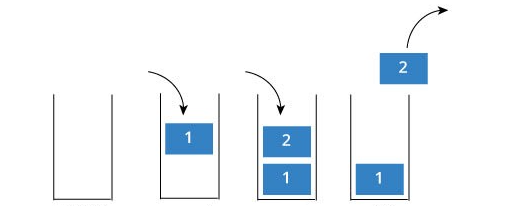

## QUEUE implementation

 

Implementing a **QUEUE** data structure is **useful** when you want to create a service that serves its users according to the **FIFO** method.

The **FIFO** method is a method that serves (_**FO - First Out**_) first the first element arrived in the QUEUE (_**FI - First In**_) and only after the others (_in chronological order of insertion into the QUEUE_).

 

A possible implementation of this data structure could concern, for example, an **assistance system** provided through **ticketing**.
In such a system we would have that:
- once the **tickets** have been **resolved**, the QUEUE is **emptied**
- when **new requests** for assistance **arrive**, the QUEUE **fills up**.

The **_STACK_** is instead a data structure that uses the _**LIFO**_ method, which is a method that serves first (_**FO - First Out**_) the last element that has been inserted into the STACK itself (_**LI - Last In**_).

 

